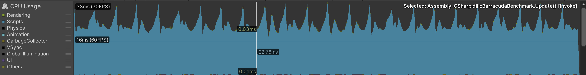
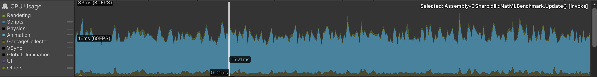
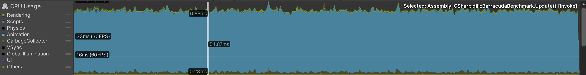
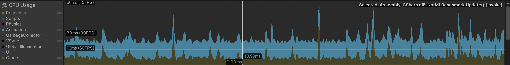
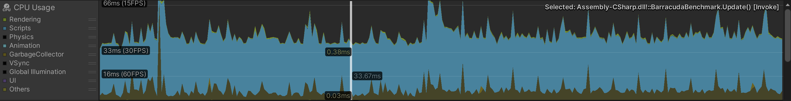

# ML Benchmark
This project benchmarks the performance of the NatML machine learning runtime for Unity Engine against other ML runtimes. Currently, the project only contains a comparison with Unity Barracuda, with OpenCVForUnity coming soon.

We use the [MobileNet v2 classification model](https://github.com/onnx/models/tree/master/vision/classification/mobilenet) for all tests.

## Configuration

| Platform | Device | Notes |
|:--|:--:|:--|
| iOS | iPhone 12 Pro | Compiled with IL2CPP. Run in `Release` mode. |
| Android | Galaxy S21 | Compiled with IL2CPP in `Release` mode for `arm64`. Vulkan graphics API. |
| macOS | MacBook Pro 2017, Intel i5 | Tested in Editor. |

Barracuda worker is configured to use `ComputePrecompiled`, which should be its fastest configuration. Also, all pre-processing for Barracuda is handled by compute shaders, which should also provide the maximum performance.

## Results

### iOS Benchmark

| Runtime | CPU Profiler |
|:--|:--:|
| NatML |  |
| Barracuda |  |

**NatML wins**. Barracuda barely maintains 30FPS while NatML runs at about 142FPS. As a result, NatML runs over 4x as fast as Barracuda, because NatML takes advantage of the Apple Neural Engine co-processor.

### Android Benchmark

| Runtime | CPU Profiler |
|:--|:--:|
| NatML |  |
| Barracuda |  |

**NatML wins**. Barracuda runs at around 18FPS, whereas NatML runs at about 60FPS. NatML runs over 3x faster, because NatML takes advantage of available neural processing units on Android devices.

### macOS Benchmark

| Runtime | CPU Profiler |
|:--|:--:|
| NatML |  |
| Barracuda |  |

**NatML wins**. Barracuda runs at about 30FPS, while NatML runs at about 52FPS. NatML runs just under 2x faster.

> It is crucial to note that on the new Apple M-series chips, NatML will run much faster.

### Windows Benchmark
*Coming soon*

___

## Requirements
- Unity 2019.2+
- Barracuda 1.0+
- NatML 1.0+

## Resources
- [NatSuite Framework](https://github.com/natsuite)
- [NatSuite Community](https://discord.gg/aVXUqeEp3e)
- [NatML Beta Waitlist](https://yusuf987639.typeform.com/to/dIL3bL2f)
- [Email Support](mailto:hi@natsuite.io)

Thank you very much!